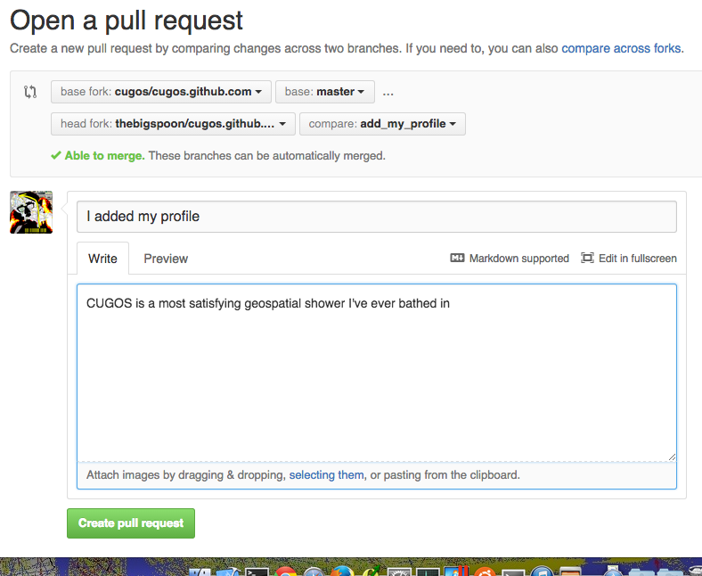

# Adding Your Profile

0. Create a GitHub Account<br/>


0. Find the `cugos.github.com` repository<br/>


0. Fork the `cugos.github.com` repository<br/>


0. When prompted, fork it to you<br/>


0. You will be brought back to your forked repository page<br/>


0. We want to add our profile to the `people` directory<br/>


0. Clone your forked repository by first copying the URL<br/>


0. Then in a bash shell on your computer find a good working directory. Clone your forked respository and follow the rest of the edit, commit, push and pull request workflow below. FYI: you will need to install `git` on your computer<br/>
```bash
$ git clone git@github.com:thebigspoon/cugos.github.com.git
Cloning into 'cugos.github.com'...
remote: Counting objects: 4148, done.
remote: Compressing objects: 100% (64/64), done.
remote: Total 4148 (delta 29), reused 0 (delta 0), pack-reused 4084
Receiving objects: 100% (4148/4148), 35.26 MiB | 4.93 MiB/s, done.
Resolving deltas: 100% (2337/2337), done.
Checking connectivity... done.
```

Create a new branch to add your profile<br/>
```bash
$ cd cugos.github.com/
$ git checkout -b add_my_profile
Switched to a new branch 'add_my_profile'
```

Go find the `people/_posts/` directory<br/>
```bash
$ cd people/_posts/
```

Copy the last persons profile and swap it out with your information. Use [bboxfinder](http://bboxfinder.com) to find your coordinates if necessary<br/>
```bash
$ cp 2015-06-19-aaron-racicot.markdown 2015-06-20-first-last.mardown
---
 
title: < your name >
category: people
lng: < your lng >
lat: < your lat >
image:  < your img >
github: < your github username >
twitter: < your twitter username >
permalink: /people/< your name >
excerpt: < your description >
---
```

`git` add the file to staging<br/>
```bash
$ git add 2015-06-20-first-last.mardown
```

`git` commit the file with a commit message<br/>
```bash
$ git commit -m "adding myself, because CUGOS rocks"
```

`git` push the change to your branch<br/>
```bash
$ git push origin add_my_profile # or whatever your branch name is 
```

Then go back GitHub, change to the master branch and refresh. You should see something like:<br/>


Click that green button. Now add a commit message


When you feel confident and worthy to pledge your honor to the CUGOS family click that green button


Go drink a beer, you did a good job. And read up on the [git workflow](http://rogerdudler.github.io/git-guide/)
